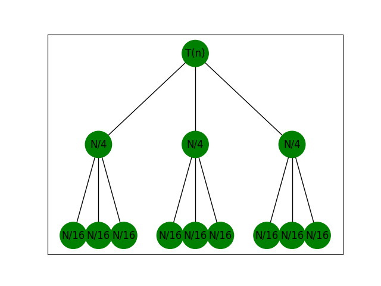

# **Questão 2**

Mostre a árvore de recursão e encontra os limites assintóticos da relação de recorrência $T(n) = 3T(n/4)+n$. Para verificar a correção da sua resposta, use o método de substituição.

# **Resposta**

**Árvore de recorrência**

Criamos uma árvore de recursão para a recorrência $T(n) = 3T(n/4)+cn$, tendo escrito o coeficiente constante implícito $c>0$.

Abaixo temos como derivamos a árvore de recursão para $T(n) = 3T(n/4)+cn$.

    

Por conveniência, assumimos que $n$ é uma potência exata de $4$ de modo que todos os tamanhos de subproblemas sejam inteiros.

Ao analizar a figura, podemos verificar que o nó raiz é $T(n)$. Considerando $i$ o nível da árvore de recorrência, a cada nível de recursão expandimos $n$ para $n/4^i$.

O termo $cn$ na raiz representa o custo no nível superior da recursão e as três subárvores da raiz representam os custos incorridos pelos subproblemas de tamanho $n/4$. O nível seguinte mostra este processo levado um passo adiante, expandindo cada nó com custo $T(n/4)$. Continuamos expandindo cada nó na árvore dividindo-o em suas partes constituintes, conforme determinado pela recorrência.

O tamanho do subproblema para um nó em $i$ é $n=4^i$.

O tamanho do subproblema atinge $n=1$ quando $n/4^i=1$ ou, equivalentemente, quando $i= \log _4 n$.

Assim, a árvore possui $\log _4 n+1$ níveis.

Uma vez que cada nó se reparte em três outros nós, o número de nós numa profundidade $i$ é $3^i$.

Cada nível após a raíz possui quatro vezes menos complexidade que o nível anterior, tendo cada um custo de $c(n/4^i)$.

O custo total sobre todos os nós na profundidade $i$, para $i=0,1,2,...,\log _4 n-1$, é $3^ic(n/4^i) = (3/16)^icn$.

O nível inferior, na profundidade $\log _4 n$, tem $3^{\log _4 n} = n\log _4 3$ nós, cada um contribuindo com custo $T(1)$, para um custo total de $n^{\log _4 3}T(1)$, que é $\theta(n^{\log _4 3})$‚ já que assumimos que $T(1)$ é uma constante.

Portanto, os custos somados por todos os níveis deve ser dado pela fórmula:

$T(n) = cn + 3/16cn + (3/16)^2cn + ... + (3/16)^{\log _4 n-1}cn + \theta(n^{\log _4 3})
\\ = \sum_{i=0}^{\log _4 n-1} (3/16)^icn + \theta(n^{\log _4 3})
\\ = ((3/16)^{\log _4 n}-1)/(3/16) \ cn  + \theta(n^{\log _4 3})$

**Limite assintótico**

Por ser uma série geométrica podemos tirar proveito utilizando uma série geométrica decrescente infinita como limite superior, sendo assim:

$T(n) = \sum_{i=0}^{\log _4 n-1} (\frac{3}{16})^icn + \Theta(n^{\log _4 3}) < 
\sum_{i=0}^{∞} (\frac{3}{16})^icn + \Theta(n^{\log _4 3})
\\ = \frac{1}{1-(3/16)}cn + \Theta(n^{\log _4 3})
\\ = \frac{16}{13}cn + \Theta(n^{\log _4 3})
\\ = \frac{1}{1-(3/16)}cn + \Theta(n^{\log _4 3})
\\ = O(n)$

Os coeficientes de $cn$ formam uma série geométrica decrescente e a soma desses coeficientes é limitada superiormente pela constante $\frac{16}{13}$. A contribuição da raiz para o custo total é $cn$, a raiz contribui com uma fração constante de custo total, ou seja, o custo da raiz domina o custo total da árvore.

**Método da substituição**

Vamos utilizar o método da substituição para verificar nosso palpite de $T(n) = O(n)$ é limite superior para a recorrência $T(n) = 3T(n/4)+n$, queremos mostrar que $T(n) \leq kn$ para algum $k>0$. Tomando uma constante $c>0$, temos

$T(n) \leq 3T(n/4)+cn$ \\
$\leq 3k(n/4)+cn$ \\
$= \frac{16}{13}kn + cn$ \\
$\leq kn$, onde esta é válida para $k \geq (\frac{16}{13})c$